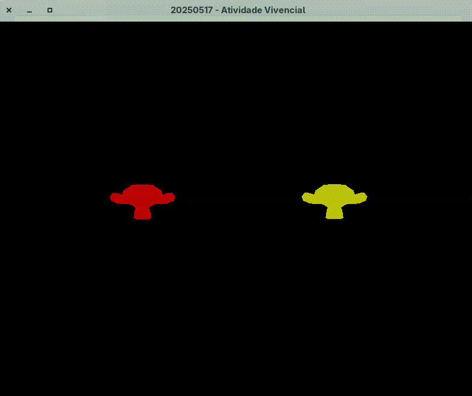

# 20250517 - Atividade Vivencial

This project demonstrates 3D object manipulation using **OpenGL** and **GLFW**, with two instances of the *Suzanne* model. The user can switch between objects, move, scale, and rotate them along different axes in real time.

## Group Members
- Augusto Leal
- Vitor Maia
- Vitor Spader

## Requirements

- OpenGL
- GLFW
- GLM
- GLAD

## Controls

### Object Selection
| Key | Action                       |
|-----|------------------------------|
| `0` | Select left Suzanne          |
| `1` | Select right Suzanne         |

### Movement
| Key | Direction        |
|-----|------------------|
| `W` | Forward (Z-)     |
| `S` | Backward (Z+)    |
| `A` | Left (X-)        |
| `D` | Right (X+)       |
| `I` | Up (Y+)          |
| `J` | Down (Y-)        |

### Scaling
| Key     | Action          |
|---------|-----------------|
| `-`     | Decrease scale  |
| `=`     | Increase scale  |

> Scale is clamped between `0.1` and `0.7`.

### Rotation (for the selected object)
| Key | Axis of Rotation |
|-----|------------------|
| `X` | Rotate around X  |
| `Y` | Rotate around Y  |
| `Z` | Rotate around Z  |

### Other
| Key       | Action                    |
|-----------|---------------------------|
| `ESC`     | Close the application     |

## Notes
- The selected object is the only one affected by transformations.
- Object positions and transformations are updated every frame.

## Animation

