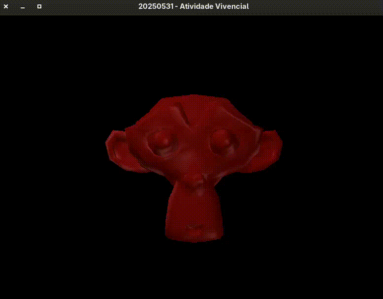
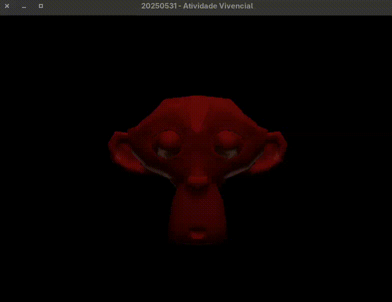

# Lighting System 

This project includes a configurable lighting setup based on a three-point lighting system.

## Group Members
- Augusto Leal
- Eduarda Pinheiro

## Light Types

| Light       | Description                                                          |
|-------------|----------------------------------------------------------------------|
| **Key**     | Main light, stronger and directional                                 |
| **Fill**    | Softer light used to reduce shadows.                                 |
| **Back**    | Medium-strength light from behind, enhances contours and silhouette. |

> Attenuation is applied to the lights.

> To enable key light movement, **uncomment** the following lines in main loop:
>
> ```cpp
> lightPos[0].x = sin(time) * 5.0f;
> lightPos[0].z = cos(time) * 5.0f;
> ```


## Lighting Controls

| Key | Action               |
|-----|----------------------|
| `1` | Toggle **Key Light** |
| `2` | Toggle **Fill Light**|
| `3` | Toggle **Back Light**|

> All lights start **enabled by default**.

## Object Movement Control

You can move the selected Suzanne model freely along the X, Y, and Z axes using the following keyboard controls:


| Key | Direction        | Axis |
|-----|------------------|------|
| `W` | Forward          | Z-   |
| `S` | Backward         | Z+   |
| `A` | Left             | X-   |
| `D` | Right            | X+   |
| `I` | Up               | Y+   |
| `J` | Down             | Y-   |

## Animation

- Multiple lights



- Key light moving


