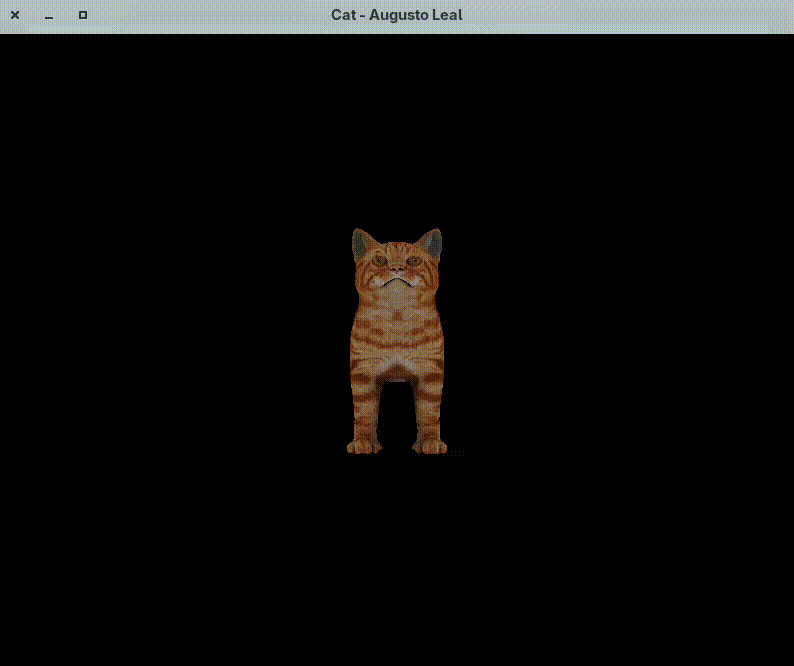
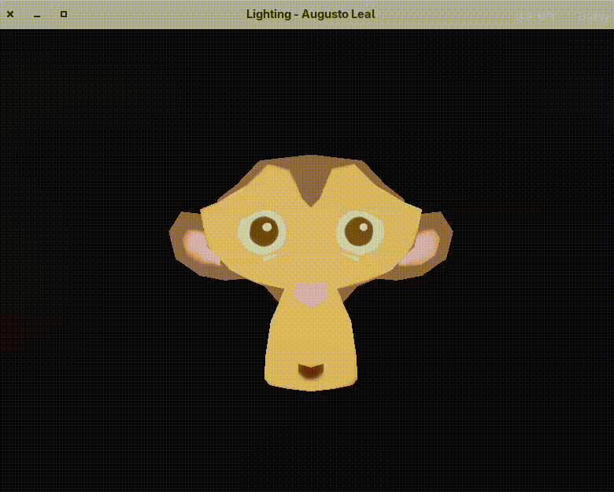

# Execution Result

Here is the output after running the program and testing with two different objects: a cat and Suzanne. This implementation also includes lighting using the Phong reflection model, allowing ambient, diffuse, and specular effects to be visualized.
### Animation

#### Cat

#### Suzanne

### Reference

- Cat was downloaded from [Free3D](https://free3d.com/3d-model/cat-v1--522281.html)
- Suzanne downloaded from the official [repository](https://github.com/fellowsheep/CGCCHibrido/tree/main/assets/Modelos3D) of the course at Unisinos. 